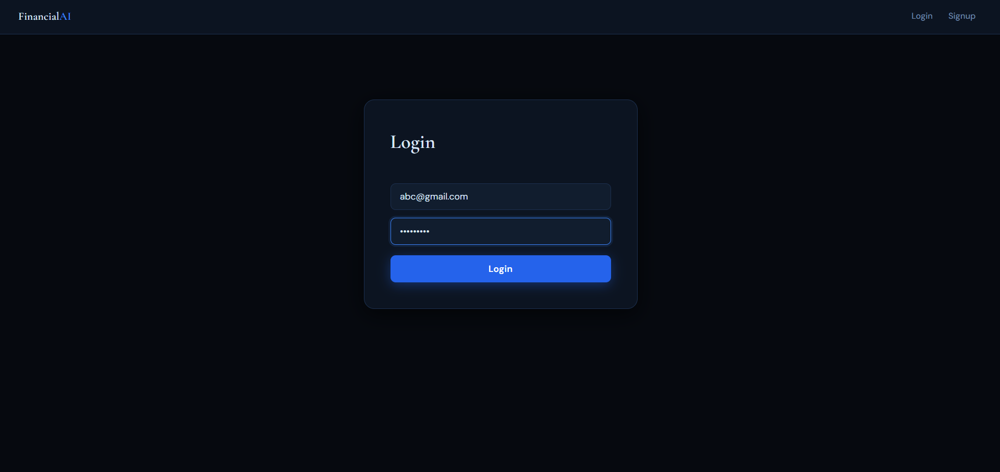
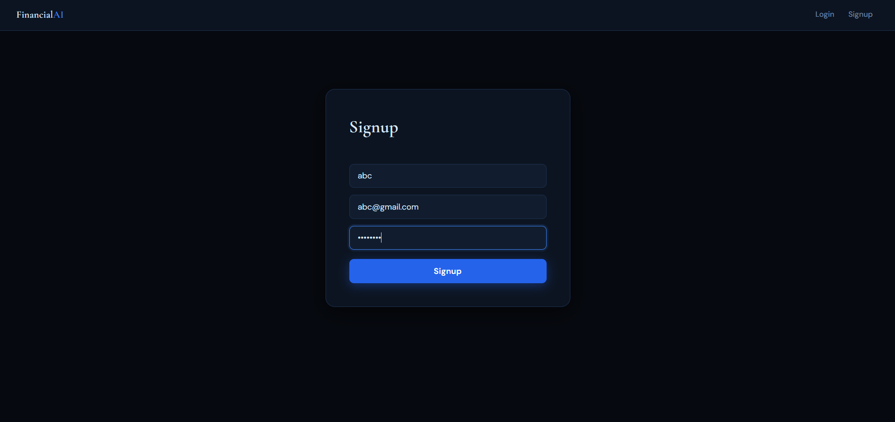
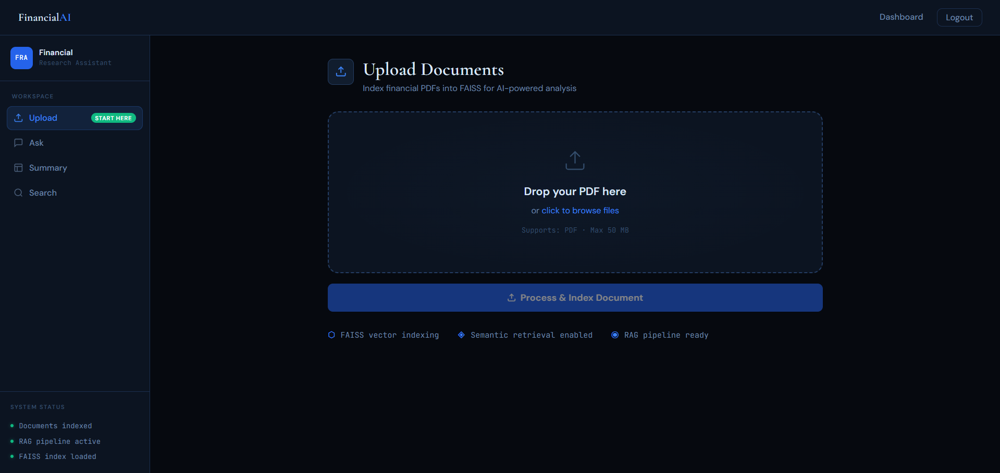
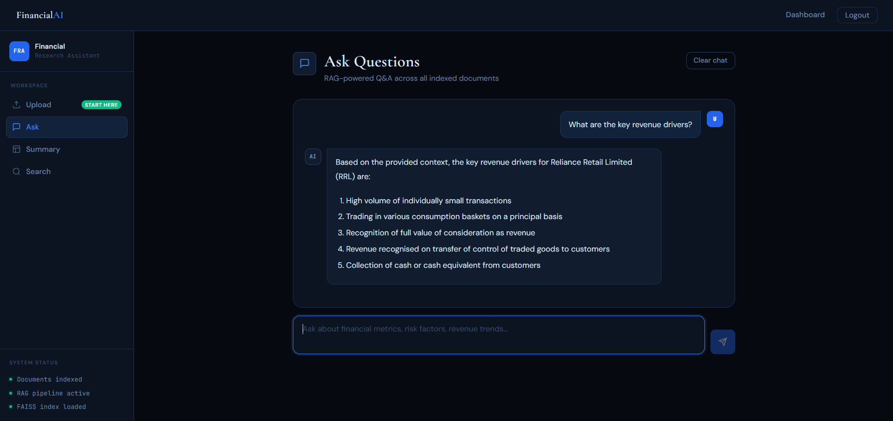
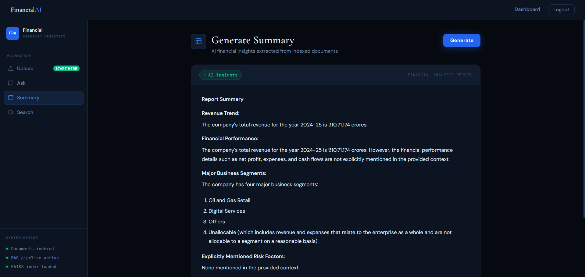
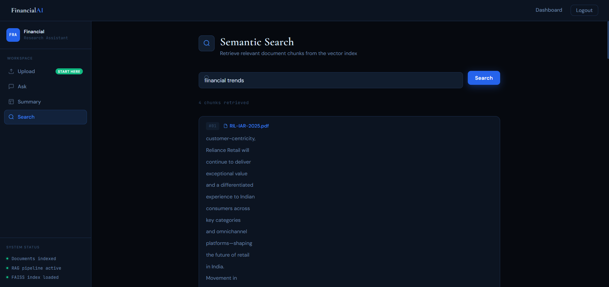

# Financial Research Assistant 📊

A **RAG-based (Retrieval-Augmented Generation) Financial Document Intelligence System** that enables users to upload financial documents (PDFs), generate intelligent summaries, and ask natural language questions about their content.

## Overview

The Financial Research Assistant is a full-stack application combining a **Python FastAPI backend** with a **React + Vite frontend**. It leverages advanced NLP models and vector databases to provide intelligent document analysis and Q&A capabilities for financial reports and documents.

### Key Features

- 📄 **PDF Upload & Processing** - Upload financial documents (e.g., annual reports, financial statements)
- 🤖 **Intelligent Summarization** - Automatically generate comprehensive summaries of uploaded documents
- ❓ **Natural Language Q&A** - Ask questions about document content and get accurate answers powered by LLMs
- 🔐 **User Authentication** - Secure login and signup with JWT-based authentication
- 🔍 **Smart Retrieval** - Vector-based document retrieval using FAISS for fast, relevant information lookup
- 💾 **SQLite Database** - Persistent storage for users and document metadata

---

## Tech Stack

### Backend
- **Framework**: FastAPI (Python)
- **Server**: Uvicorn
- **NLP Pipeline**:
  - LangChain & LangChain Community - LLM orchestration
  - Groq API - Fast LLM inference
  - HuggingFace - Embedding models
  - Sentence Transformers - Text embeddings
- **Vector Database**: FAISS (Facebook AI Similarity Search)
- **Document Processing**: PyPDF
- **Authentication**: Python-Jose (JWT), Passlib (bcrypt hashing)
- **Database**: SQLAlchemy + SQLite
- **CORS**: Enabled for frontend communication

### Frontend
- **Framework**: React 19 + Vite
- **HTTP Client**: Axios
- **Routing**: React Router v7
- **Build Tool**: Vite with Vitejs React plugin
- **Development Server**: Fast refresh with HMR (Hot Module Replacement)

---

## Project Structure

```
.
├── backend/
│   ├── main.py                 # FastAPI application entry point
│   ├── auth.py                 # JWT authentication & password hashing
│   ├── database.py             # SQLAlchemy models and DB setup
│   ├── document_loader.py      # PDF loading and processing
│   ├── chunking.py             # Document chunking strategies
│   ├── vector_store.py         # FAISS vector store management
│   ├── rag_pipeline.py         # RAG query pipeline
│   └── summarizer.py           # Document summarization logic
├── frontend/
│   ├── src/
│   │   ├── pages/              # React pages (Login, Signup, Dashboard)
│   │   ├── components/         # Reusable components (ProtectedRoute, Navbar)
│   │   ├── services/           # API service modules
│   │   │   ├── authService.js  # Authentication API calls
│   │   │   ├── uploadService.js # Document upload
│   │   │   ├── searchService.js # Query search
│   │   │   ├── summaryService.js # Summary generation
│   │   │   └── askService.js   # Q&A API calls
│   │   ├── App.jsx             # Main app component
│   │   └── api.js              # Axios instance configuration
│   ├── package.json
│   └── vite.config.js
├── sample_data/
│   └── reports/                # Storage for uploaded PDF files
├── requirements.txt            # Python dependencies
└── README.md
```

---

## Installation & Setup

### Prerequisites
- Python 3.8+
- Node.js 16+
- npm or yarn

### Backend Setup

1. **Clone the repository**
   ```bash
   git clone https://github.com/vedantghodekar15/financial-research-assistant.git
   cd financial-research-assistant
   ```

2. **Create a virtual environment**
   ```bash
   python -m venv venv
   source venv/bin/activate      # On Windows: venv\Scripts\activate
   ```

3. **Install Python dependencies**
   ```bash
   pip install -r requirements.txt
   ```

4. **Set up environment variables** (create `.env` file in backend directory)
   ```env
   # Database
   DATABASE_URL=sqlite:///./financial_assistant.db
   
   # JWT
   SECRET_KEY=your-secret-key-here
   ALGORITHM=HS256
   ACCESS_TOKEN_EXPIRE_MINUTES=30
   
   # LLM API
   GROQ_API_KEY=your-groq-api-key
   ```

5. **Run the backend server**
   ```bash
   cd backend
   uvicorn main:app --reload --host 0.0.0.0 --port 8000
   ```
   
   Backend will be available at: `http://localhost:8000`
   API documentation: `http://localhost:8000/docs`

### Frontend Setup

1. **Navigate to frontend directory**
   ```bash
   cd frontend
   ```

2. **Install dependencies**
   ```bash
   npm install
   ```

3. **Run the development server**
   ```bash
   npm run dev
   ```
   
   Frontend will be available at: `http://localhost:5173`

---

## API Endpoints

### Authentication
- `POST /signup` - Register a new user
- `POST /login` - Authenticate and get JWT token

### Document Management
- `POST /upload` - Upload a PDF file (requires authentication)
- `GET /documents` - List user's uploaded documents (requires authentication)

### Query & Analysis
- `POST /ask` - Ask a question about uploaded documents (requires authentication)
- `POST /summarize` - Generate a summary of a document (requires authentication)
- `POST /search` - Search for relevant documents (requires authentication)

### Documentation
- `GET /docs` - Interactive API documentation (Swagger UI)
- `GET /redoc` - Alternative API documentation (ReDoc)

---

## Usage Workflow

1. **Sign Up/Login** - Create an account or log in to access the application

2. **Upload Documents** - Upload financial PDF files through the dashboard

3. **Generate Summaries** - Get automatic summaries of uploaded documents

4. **Ask Questions** - Query documents using natural language:
   - Example: *"What was the total revenue in 2024?"*
   - Example: *"How did operating expenses change year-over-year?"*

5. **View Results** - Get contextual answers with relevant document excerpts

---

## Key Technologies Explained

### RAG (Retrieval-Augmented Generation)
The system combines:
1. **Retrieval** - FAISS vector database finds relevant document chunks
2. **Augmentation** - Retrieved content is added to the LLM prompt
3. **Generation** - Groq LLM generates accurate answers based on document context

### Vector Embeddings
- Documents are converted to embeddings using Sentence Transformers
- Embeddings are stored in FAISS for fast similarity search
- Enables semantic understanding of document content

### Authentication
- JWT tokens for secure API access
- Passwords hashed with bcrypt
- Token expiration after configured time period


## Environment Variables Reference

### Backend (.env)
```env
# Database Configuration
DATABASE_URL=sqlite:///./financial_assistant.db

# JWT Configuration
SECRET_KEY=<your-secret-key>
ALGORITHM=HS256
ACCESS_TOKEN_EXPIRE_MINUTES=30

# API Keys
GROQ_API_KEY=<your-groq-api-key>

# CORS
FRONTEND_URL=http://localhost:5173
```


---

## Requirements

See `requirements.txt` for Python dependencies:
- FastAPI & Uvicorn
- LangChain ecosystem
- FAISS (CPU)
- PyPDF, Sentence Transformers, Transformers
- SQLAlchemy, Passlib
- Python-dotenv

---

## Screenshots

### Authentication

| Login | Signup |
|--------|---------|
|  |  |

### Document Upload



### Question Answering



### AI Summary Generation



### Semantic Search



## Acknowledgments

- FastAPI & Uvicorn for the excellent Python web framework
- LangChain for RAG orchestration
- Groq for fast LLM inference
- Facebook AI for FAISS vector database
- React & Vite teams for the frontend toolkit
